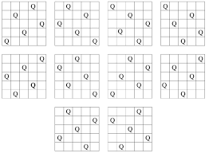
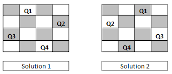
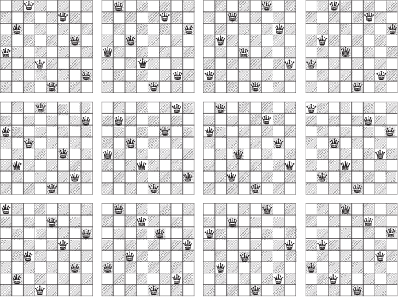

# picocli example: solve queens puzzle with choco-solver  



# Install

## Installl prerequisites

Install [sdkman](https://sdkman.io/) for your platform.

### graalvm 

Install graalvm via sdkman

```bash
$ sdk install java 22.3.2.r17-grl
$ source ~/.sdkman/bin/sdkman-init.sh 
```
### graalvm native-image

Install graalvm-native-image via graalvm

```bash
$ gu install native-image 
```

##  build

Build package

```bash
$ ./gradlew build
```

# Usage

## 2 queens

```bash
$ ./build/native-image/queensSolver 2
No solution found for 2 queens%
```

## 3 queens

```bash
$ ./build/native-image/queensSolver 3
No solution found for 3 queens
```

## 4 queens 



```bash
$ ./build/native-image/queensSolver 4

Solution: Q_0=2, Q_1=4, Q_2=1, Q_3=3, 
Solution: Q_0=3, Q_1=1, Q_2=4, Q_3=2, 
```

## 5 queens


```bash
$ ./build/native-image/queensSolver 5

Solution: Q_0=1, Q_1=3, Q_2=5, Q_3=2, Q_4=4, 
Solution: Q_0=1, Q_1=4, Q_2=2, Q_3=5, Q_4=3, 
Solution: Q_0=4, Q_1=2, Q_2=5, Q_3=3, Q_4=1, 
Solution: Q_0=3, Q_1=5, Q_2=2, Q_3=4, Q_4=1, 
Solution: Q_0=5, Q_1=3, Q_2=1, Q_3=4, Q_4=2, 
Solution: Q_0=4, Q_1=1, Q_2=3, Q_3=5, Q_4=2, 
Solution: Q_0=5, Q_1=2, Q_2=4, Q_3=1, Q_4=3, 
Solution: Q_0=2, Q_1=5, Q_2=3, Q_3=1, Q_4=4, 
Solution: Q_0=2, Q_1=4, Q_2=1, Q_3=3, Q_4=5, 
Solution: Q_0=3, Q_1=1, Q_2=4, Q_3=2, Q_4=5, 
```

## 6 queens

```bash
$ ./build/native-image/queensSolver 6

Solution: Q_0=5, Q_1=3, Q_2=1, Q_3=6, Q_4=4, Q_5=2, 
Solution: Q_0=3, Q_1=6, Q_2=2, Q_3=5, Q_4=1, Q_5=4, 
Solution: Q_0=4, Q_1=1, Q_2=5, Q_3=2, Q_4=6, Q_5=3, 
Solution: Q_0=2, Q_1=4, Q_2=6, Q_3=1, Q_4=3, Q_5=5,
```

# 7 queens

```bash
$ ./build/native-image/queensSolver 7

Solution: Q_0=5, Q_1=7, Q_2=2, Q_3=6, Q_4=3, Q_5=1, Q_6=4, 
Solution: Q_0=4, Q_1=2, Q_2=7, Q_3=5, Q_4=3, Q_5=1, Q_6=6, 
Solution: Q_0=4, Q_1=7, Q_2=5, Q_3=2, Q_4=6, Q_5=1, Q_6=3, 
Solution: Q_0=7, Q_1=3, Q_2=6, Q_3=2, Q_4=5, Q_5=1, Q_6=4, 
Solution: Q_0=3, Q_1=7, Q_2=2, Q_3=4, Q_4=6, Q_5=1, Q_6=5, 
Solution: Q_0=5, Q_1=7, Q_2=2, Q_3=4, Q_4=6, Q_5=1, Q_6=3, 
Solution: Q_0=2, Q_1=6, Q_2=3, Q_3=7, Q_4=4, Q_5=1, Q_6=5, 
Solution: Q_0=7, Q_1=4, Q_2=1, Q_3=5, Q_4=2, Q_5=6, Q_6=3, 
Solution: Q_0=4, Q_1=6, Q_2=1, Q_3=3, Q_4=5, Q_5=7, Q_6=2, 
Solution: Q_0=6, Q_1=3, Q_2=1, Q_3=4, Q_4=7, Q_5=5, Q_6=2, 
Solution: Q_0=5, Q_1=3, Q_2=1, Q_3=6, Q_4=4, Q_5=2, Q_6=7, 
Solution: Q_0=2, Q_1=4, Q_2=1, Q_3=7, Q_4=5, Q_5=3, Q_6=6, 
Solution: Q_0=2, Q_1=5, Q_2=1, Q_3=4, Q_4=7, Q_5=3, Q_6=6, 
Solution: Q_0=6, Q_1=4, Q_2=2, Q_3=7, Q_4=5, Q_5=3, Q_6=1, 
Solution: Q_0=3, Q_1=6, Q_2=2, Q_3=5, Q_4=1, Q_5=4, Q_6=7, 
Solution: Q_0=1, Q_1=5, Q_2=2, Q_3=6, Q_4=3, Q_5=7, Q_6=4, 
Solution: Q_0=4, Q_1=1, Q_2=3, Q_3=6, Q_4=2, Q_5=7, Q_6=5, 
Solution: Q_0=6, Q_1=1, Q_2=3, Q_3=5, Q_4=7, Q_5=2, Q_6=4, 
Solution: Q_0=7, Q_1=5, Q_2=3, Q_3=1, Q_4=6, Q_5=4, Q_6=2, 
Solution: Q_0=2, Q_1=5, Q_2=3, Q_3=1, Q_4=7, Q_5=4, Q_6=6, 
Solution: Q_0=4, Q_1=7, Q_2=3, Q_3=6, Q_4=2, Q_5=5, Q_6=1, 
Solution: Q_0=1, Q_1=6, Q_2=4, Q_3=2, Q_4=7, Q_5=5, Q_6=3, 
Solution: Q_0=3, Q_1=7, Q_2=4, Q_3=1, Q_4=5, Q_5=2, Q_6=6, 
Solution: Q_0=7, Q_1=2, Q_2=4, Q_3=6, Q_4=1, Q_5=3, Q_6=5, 
Solution: Q_0=5, Q_1=1, Q_2=4, Q_3=7, Q_4=3, Q_5=6, Q_6=2, 
Solution: Q_0=1, Q_1=3, Q_2=5, Q_3=7, Q_4=2, Q_5=4, Q_6=6, 
Solution: Q_0=2, Q_1=7, Q_2=5, Q_3=3, Q_4=1, Q_5=6, Q_6=4, 
Solution: Q_0=4, Q_1=1, Q_2=5, Q_3=2, Q_4=6, Q_5=3, Q_6=7, 
Solution: Q_0=6, Q_1=2, Q_2=5, Q_3=1, Q_4=4, Q_5=7, Q_6=3, 
Solution: Q_0=6, Q_1=3, Q_2=5, Q_3=7, Q_4=1, Q_5=4, Q_6=2, 
Solution: Q_0=2, Q_1=4, Q_2=6, Q_3=1, Q_4=3, Q_5=5, Q_6=7, 
Solution: Q_0=3, Q_1=1, Q_2=6, Q_3=2, Q_4=5, Q_5=7, Q_6=4, 
Solution: Q_0=5, Q_1=2, Q_2=6, Q_3=3, Q_4=7, Q_5=4, Q_6=1, 
Solution: Q_0=5, Q_1=1, Q_2=6, Q_3=4, Q_4=2, Q_5=7, Q_6=3, 
Solution: Q_0=3, Q_1=1, Q_2=6, Q_3=4, Q_4=2, Q_5=7, Q_6=5, 
Solution: Q_0=1, Q_1=4, Q_2=7, Q_3=3, Q_4=6, Q_5=2, Q_6=5, 
Solution: Q_0=2, Q_1=5, Q_2=7, Q_3=4, Q_4=1, Q_5=3, Q_6=6, 
Solution: Q_0=6, Q_1=4, Q_2=7, Q_3=1, Q_4=3, Q_5=5, Q_6=2, 
Solution: Q_0=6, Q_1=3, Q_2=7, Q_3=4, Q_4=1, Q_5=5, Q_6=2, 
Solution: Q_0=3, Q_1=5, Q_2=7, Q_3=2, Q_4=4, Q_5=6, Q_6=1,
```

## 8 queens



```bash
$ ./build/native-image/queensSolver 8         

Solution: Q_0=7, Q_1=4, Q_2=2, Q_3=5, Q_4=8, Q_5=1, Q_6=3, Q_7=6, 
Solution: Q_0=7, Q_1=4, Q_2=2, Q_3=8, Q_4=6, Q_5=1, Q_6=3, Q_7=5, 
Solution: Q_0=5, Q_1=7, Q_2=2, Q_3=6, Q_4=3, Q_5=1, Q_6=8, Q_7=4, 
Solution: Q_0=5, Q_1=7, Q_2=2, Q_3=6, Q_4=3, Q_5=1, Q_6=4, Q_7=8, 
Solution: Q_0=3, Q_1=6, Q_2=2, Q_3=7, Q_4=5, Q_5=1, Q_6=8, Q_7=4, 
Solution: Q_0=3, Q_1=6, Q_2=2, Q_3=5, Q_4=8, Q_5=1, Q_6=7, Q_7=4, 
Solution: Q_0=3, Q_1=7, Q_2=2, Q_3=8, Q_4=5, Q_5=1, Q_6=4, Q_7=6, 
Solution: Q_0=5, Q_1=7, Q_2=2, Q_3=4, Q_4=8, Q_5=1, Q_6=3, Q_7=6, 
Solution: Q_0=2, Q_1=4, Q_2=6, Q_3=8, Q_4=3, Q_5=1, Q_6=7, Q_7=5, 
Solution: Q_0=7, Q_1=3, Q_2=8, Q_3=2, Q_4=5, Q_5=1, Q_6=6, Q_7=4, 
Solution: Q_0=4, Q_1=6, Q_2=8, Q_3=2, Q_4=7, Q_5=1, Q_6=3, Q_7=5, 
Solution: Q_0=4, Q_1=7, Q_2=5, Q_3=2, Q_4=6, Q_5=1, Q_6=3, Q_7=8, 
Solution: Q_0=3, Q_1=6, Q_2=8, Q_3=2, Q_4=4, Q_5=1, Q_6=7, Q_7=5, 
Solution: Q_0=5, Q_1=3, Q_2=8, Q_3=4, Q_4=7, Q_5=1, Q_6=6, Q_7=2, 
Solution: Q_0=4, Q_1=2, Q_2=8, Q_3=5, Q_4=7, Q_5=1, Q_6=3, Q_7=6, 
Solution: Q_0=4, Q_1=2, Q_2=5, Q_3=8, Q_4=6, Q_5=1, Q_6=3, Q_7=7, 
Solution: Q_0=6, Q_1=4, Q_2=2, Q_3=8, Q_4=5, Q_5=7, Q_6=1, Q_7=3, 
Solution: Q_0=2, Q_1=7, Q_2=3, Q_3=6, Q_4=8, Q_5=5, Q_6=1, Q_7=4, 
Solution: Q_0=4, Q_1=7, Q_2=3, Q_3=8, Q_4=2, Q_5=5, Q_6=1, Q_7=6, 
Solution: Q_0=3, Q_1=7, Q_2=2, Q_3=8, Q_4=6, Q_5=4, Q_6=1, Q_7=5, 
Solution: Q_0=6, Q_1=3, Q_2=7, Q_3=2, Q_4=4, Q_5=8, Q_6=1, Q_7=5, 
Solution: Q_0=4, Q_1=2, Q_2=7, Q_3=3, Q_4=6, Q_5=8, Q_6=1, Q_7=5, 
Solution: Q_0=5, Q_1=2, Q_2=4, Q_3=6, Q_4=8, Q_5=3, Q_6=1, Q_7=7, 
Solution: Q_0=6, Q_1=3, Q_2=7, Q_3=2, Q_4=8, Q_5=5, Q_6=1, Q_7=4, 
Solution: Q_0=4, Q_1=7, Q_2=1, Q_3=8, Q_4=5, Q_5=2, Q_6=6, Q_7=3, 
Solution: Q_0=4, Q_1=8, Q_2=1, Q_3=3, Q_4=6, Q_5=2, Q_6=7, Q_7=5, 
Solution: Q_0=4, Q_1=8, Q_2=1, Q_3=5, Q_4=7, Q_5=2, Q_6=6, Q_7=3, 
Solution: Q_0=5, Q_1=3, Q_2=1, Q_3=6, Q_4=8, Q_5=2, Q_6=4, Q_7=7, 
Solution: Q_0=6, Q_1=4, Q_2=1, Q_3=5, Q_4=8, Q_5=2, Q_6=7, Q_7=3, 
Solution: Q_0=6, Q_1=3, Q_2=1, Q_3=8, Q_4=5, Q_5=2, Q_6=4, Q_7=7, 
Solution: Q_0=6, Q_1=3, Q_2=1, Q_3=8, Q_4=4, Q_5=2, Q_6=7, Q_7=5, 
Solution: Q_0=8, Q_1=4, Q_2=1, Q_3=3, Q_4=6, Q_5=2, Q_6=7, Q_7=5, 
Solution: Q_0=3, Q_1=5, Q_2=7, Q_3=1, Q_4=4, Q_5=2, Q_6=8, Q_7=6, 
Solution: Q_0=5, Q_1=8, Q_2=4, Q_3=1, Q_4=7, Q_5=2, Q_6=6, Q_7=3, 
Solution: Q_0=5, Q_1=1, Q_2=4, Q_3=6, Q_4=8, Q_5=2, Q_6=7, Q_7=3, 
Solution: Q_0=1, Q_1=7, Q_2=4, Q_3=6, Q_4=8, Q_5=2, Q_6=5, Q_7=3, 
Solution: Q_0=6, Q_1=4, Q_2=7, Q_3=1, Q_4=8, Q_5=2, Q_6=5, Q_7=3, 
Solution: Q_0=3, Q_1=1, Q_2=7, Q_3=5, Q_4=8, Q_5=2, Q_6=4, Q_7=6, 
Solution: Q_0=5, Q_1=2, Q_2=8, Q_3=1, Q_4=4, Q_5=7, Q_6=3, Q_7=6, 
Solution: Q_0=5, Q_1=2, Q_2=6, Q_3=1, Q_4=7, Q_5=4, Q_6=8, Q_7=3, 
Solution: Q_0=6, Q_1=2, Q_2=7, Q_3=1, Q_4=3, Q_5=5, Q_6=8, Q_7=4, 
Solution: Q_0=6, Q_1=2, Q_2=7, Q_3=1, Q_4=4, Q_5=8, Q_6=5, Q_7=3, 
Solution: Q_0=7, Q_1=2, Q_2=4, Q_3=1, Q_4=8, Q_5=5, Q_6=3, Q_7=6, 
Solution: Q_0=8, Q_1=2, Q_2=4, Q_3=1, Q_4=7, Q_5=5, Q_6=3, Q_7=6, 
Solution: Q_0=6, Q_1=4, Q_2=7, Q_3=1, Q_4=3, Q_5=5, Q_6=2, Q_7=8, 
Solution: Q_0=3, Q_1=6, Q_2=8, Q_3=1, Q_4=4, Q_5=7, Q_6=5, Q_7=2, 
Solution: Q_0=3, Q_1=6, Q_2=4, Q_3=1, Q_4=8, Q_5=5, Q_6=7, Q_7=2, 
Solution: Q_0=5, Q_1=7, Q_2=4, Q_3=1, Q_4=3, Q_5=8, Q_6=6, Q_7=2, 
Solution: Q_0=7, Q_1=5, Q_2=3, Q_3=1, Q_4=6, Q_5=8, Q_6=2, Q_7=4, 
Solution: Q_0=2, Q_1=5, Q_2=7, Q_3=1, Q_4=3, Q_5=8, Q_6=6, Q_7=4, 
Solution: Q_0=2, Q_1=8, Q_2=6, Q_3=1, Q_4=3, Q_5=5, Q_6=7, Q_7=4, 
Solution: Q_0=5, Q_1=8, Q_2=4, Q_3=1, Q_4=3, Q_5=6, Q_6=2, Q_7=7, 
Solution: Q_0=3, Q_1=6, Q_2=8, Q_3=1, Q_4=5, Q_5=7, Q_6=2, Q_7=4, 
Solution: Q_0=3, Q_1=5, Q_2=2, Q_3=8, Q_4=6, Q_5=4, Q_6=7, Q_7=1, 
Solution: Q_0=5, Q_1=2, Q_2=4, Q_3=7, Q_4=3, Q_5=8, Q_6=6, Q_7=1, 
Solution: Q_0=4, Q_1=2, Q_2=7, Q_3=3, Q_4=6, Q_5=8, Q_6=5, Q_7=1, 
Solution: Q_0=3, Q_1=6, Q_2=4, Q_3=2, Q_4=8, Q_5=5, Q_6=7, Q_7=1, 
Solution: Q_0=4, Q_1=2, Q_2=7, Q_3=5, Q_4=1, Q_5=8, Q_6=6, Q_7=3, 
Solution: Q_0=7, Q_1=2, Q_2=6, Q_3=3, Q_4=1, Q_5=4, Q_6=8, Q_7=5, 
Solution: Q_0=8, Q_1=2, Q_2=5, Q_3=3, Q_4=1, Q_5=7, Q_6=4, Q_7=6, 
Solution: Q_0=4, Q_1=2, Q_2=8, Q_3=6, Q_4=1, Q_5=3, Q_6=5, Q_7=7, 
Solution: Q_0=2, Q_1=5, Q_2=7, Q_3=4, Q_4=1, Q_5=8, Q_6=6, Q_7=3, 
Solution: Q_0=2, Q_1=6, Q_2=8, Q_3=3, Q_4=1, Q_5=4, Q_6=7, Q_7=5, 
Solution: Q_0=2, Q_1=7, Q_2=5, Q_3=8, Q_4=1, Q_5=4, Q_6=6, Q_7=3, 
Solution: Q_0=6, Q_1=3, Q_2=5, Q_3=8, Q_4=1, Q_5=4, Q_6=2, Q_7=7, 
Solution: Q_0=6, Q_1=3, Q_2=5, Q_3=7, Q_4=1, Q_5=4, Q_6=2, Q_7=8, 
Solution: Q_0=6, Q_1=3, Q_2=7, Q_3=4, Q_4=1, Q_5=8, Q_6=2, Q_7=5, 
Solution: Q_0=6, Q_1=8, Q_2=2, Q_3=4, Q_4=1, Q_5=7, Q_6=5, Q_7=3, 
Solution: Q_0=3, Q_1=5, Q_2=2, Q_3=8, Q_4=1, Q_5=7, Q_6=4, Q_7=6, 
Solution: Q_0=3, Q_1=6, Q_2=2, Q_3=7, Q_4=1, Q_5=4, Q_6=8, Q_7=5, 
Solution: Q_0=3, Q_1=5, Q_2=8, Q_3=4, Q_4=1, Q_5=7, Q_6=2, Q_7=6, 
Solution: Q_0=4, Q_1=6, Q_2=8, Q_3=3, Q_4=1, Q_5=7, Q_6=5, Q_7=2, 
Solution: Q_0=4, Q_1=7, Q_2=5, Q_3=3, Q_4=1, Q_5=6, Q_6=8, Q_7=2, 
Solution: Q_0=4, Q_1=8, Q_2=5, Q_3=3, Q_4=1, Q_5=7, Q_6=2, Q_7=6, 
Solution: Q_0=3, Q_1=8, Q_2=4, Q_3=7, Q_4=1, Q_5=6, Q_6=2, Q_7=5, 
Solution: Q_0=6, Q_1=1, Q_2=5, Q_3=2, Q_4=8, Q_5=3, Q_6=7, Q_7=4, 
Solution: Q_0=4, Q_1=1, Q_2=5, Q_3=8, Q_4=6, Q_5=3, Q_6=7, Q_7=2, 
Solution: Q_0=5, Q_1=7, Q_2=1, Q_3=4, Q_4=2, Q_5=8, Q_6=6, Q_7=3, 
Solution: Q_0=5, Q_1=1, Q_2=8, Q_3=4, Q_4=2, Q_5=7, Q_6=3, Q_7=6, 
Solution: Q_0=1, Q_1=7, Q_2=5, Q_3=8, Q_4=2, Q_5=4, Q_6=6, Q_7=3, 
Solution: Q_0=4, Q_1=6, Q_2=1, Q_3=5, Q_4=2, Q_5=8, Q_6=3, Q_7=7, 
Solution: Q_0=8, Q_1=3, Q_2=1, Q_3=6, Q_4=2, Q_5=5, Q_6=7, Q_7=4, 
Solution: Q_0=5, Q_1=3, Q_2=1, Q_3=7, Q_4=2, Q_5=8, Q_6=6, Q_7=4, 
Solution: Q_0=4, Q_1=1, Q_2=5, Q_3=8, Q_4=2, Q_5=7, Q_6=3, Q_7=6, 
Solution: Q_0=7, Q_1=1, Q_2=3, Q_3=8, Q_4=6, Q_5=4, Q_6=2, Q_7=5, 
Solution: Q_0=1, Q_1=6, Q_2=8, Q_3=3, Q_4=7, Q_5=4, Q_6=2, Q_7=5, 
Solution: Q_0=7, Q_1=3, Q_2=1, Q_3=6, Q_4=8, Q_5=5, Q_6=2, Q_7=4, 
Solution: Q_0=5, Q_1=7, Q_2=1, Q_3=3, Q_4=8, Q_5=6, Q_6=4, Q_7=2, 
Solution: Q_0=6, Q_1=3, Q_2=1, Q_3=7, Q_4=5, Q_5=8, Q_6=2, Q_7=4, 
Solution: Q_0=2, Q_1=6, Q_2=1, Q_3=7, Q_4=4, Q_5=8, Q_6=3, Q_7=5, 
Solution: Q_0=1, Q_1=5, Q_2=8, Q_3=6, Q_4=3, Q_5=7, Q_6=2, Q_7=4, 
Solution: Q_0=5, Q_1=1, Q_2=8, Q_3=6, Q_4=3, Q_5=7, Q_6=2, Q_7=4, 

```